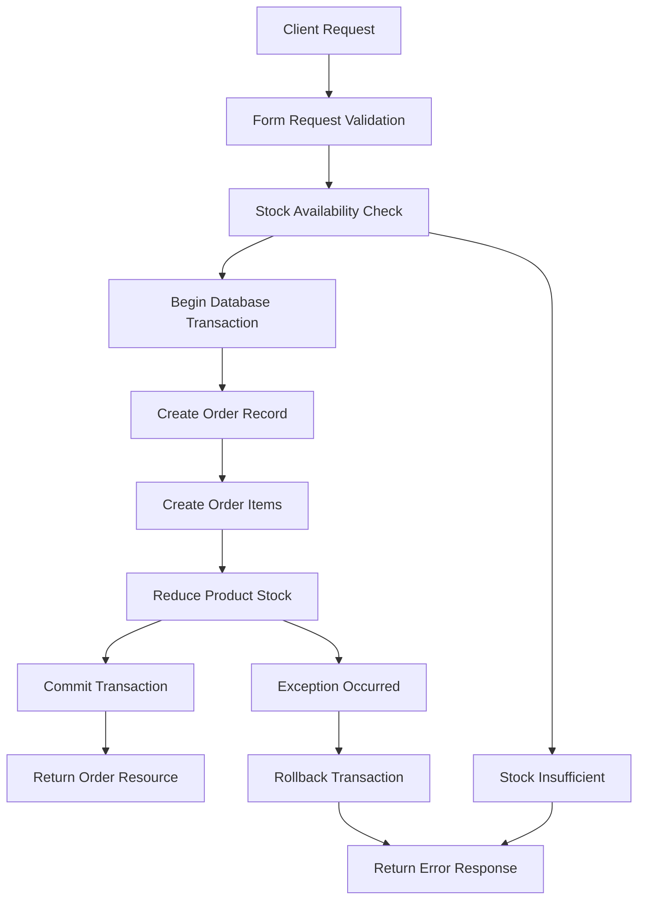

# 🌱 EcoShop - Eco-Friendly E-Commerce API

<div align="center">


*A comprehensive RESTful API for sustainable e-commerce built with Laravel*

</div>

## 🚀 **Overview**

EcoShop is a modern, secure, and scalable e-commerce API designed specifically for eco-friendly products. Built with Laravel 11 and MySQL, it provides a robust backend solution with advanced features including role-based access control, intelligent stock management, and comprehensive review system.

## ✨ **Key Features**

### 🛍️ **Product Management**
- **🔧 Admin Panel**: Complete CRUD operations with advanced controls
- **👥 Public Access**: Browse products without authentication  
- **📊 Smart Analytics**: Automatic rating calculations and stock tracking
- **🏷️ Rich Product Data**: Detailed descriptions, pricing, and inventory management

### 📦 **Advanced Order System**
- **🛒 Multi-Item Orders**: Support for complex shopping carts
- **⚡ Real-time Stock Validation**: Prevents overselling with instant checks
- **🔄 Atomic Transactions**: Database consistency with rollback protection
- **👤 User Authorization**: Secure access to personal order history
- **📈 Admin Dashboard**: Complete order management and analytics

### ⭐ **Intelligent Review System**
- **✅ Purchase Verification**: Reviews only from verified buyers
- **🚫 Duplicate Prevention**: One review per user per product
- **📝 Rich Reviews**: 5-star rating system with detailed comments
- **🌐 Public Transparency**: Open review access for all users

### 🔐 **Enterprise Security**
- **🎟️ Laravel Sanctum**: Industry-standard token authentication
- **👨‍💼 Role-Based Access**: Granular permissions (Admin/User)
- **🛡️ Route Protection**: Multi-layer security middleware
- **🚀 API Versioning**: Future-proof with `/api/v1/` structure

## Installation

1. **Clone the repository**
   ```bash
   git clone <repository-url>
   cd EcoShop
   ```

2. **Install dependencies**
   ```bash
   composer install
   ```

3. **Environment Setup**
   ```bash
   cp .env.example .env
   php artisan key:generate
   ```

4. **Database Configuration**
   Update your `.env` file with MySQL database settings:
   ```env
   DB_CONNECTION=mysql
   DB_HOST=127.0.0.1
   DB_PORT=3306
   DB_DATABASE=ecoshop
   DB_USERNAME=root
   DB_PASSWORD=your-password
   ```

5. **Create Database**
   ```bash
   mysql -u root -p -e "CREATE DATABASE ecoshop;"
   ```

6. **Run Migrations & Seeders**
   ```bash
   php artisan migrate
   php artisan db:seed --class=EcoShopSeeder
   ```

7. **Start the Development Server**
   ```bash
   php artisan serve
   ```

## API Documentation

### Base URL
```
http://localhost:8000/api/v1
```

### Authentication

#### Register User
```http
POST /api/v1/auth/register
Content-Type: application/json

{
    "name": "John Doe",
    "email": "john@example.com",
    "password": "password123",
    "password_confirmation": "password123",
    "role": "user" // optional, defaults to "user"
}
```

#### Login
```http
POST /api/v1/auth/login
Content-Type: application/json

{
    "email": "john@example.com",
    "password": "password123"
}
```

#### Logout
```http
POST /api/v1/auth/logout
Authorization: Bearer {token}
```

### Products

#### Get All Products (Public)
```http
GET /api/v1/products
```

#### Get Single Product (Public)
```http
GET /api/v1/products/{id}
```

#### Create Product (Admin Only)
```http
POST /api/v1/admin/products
Authorization: Bearer {admin-token}
Content-Type: application/json

{
    "name": "Eco Product",
    "description": "Environmentally friendly product",
    "price": 19.99,
    "stock": 50
}
```

#### Update Product (Admin Only)
```http
PUT /api/v1/admin/products/{id}
Authorization: Bearer {admin-token}
Content-Type: application/json

{
    "name": "Updated Product Name",
    "price": 24.99
}
```

#### Delete Product (Admin Only)
```http
DELETE /api/v1/admin/products/{id}
Authorization: Bearer {admin-token}
```

### Orders

#### Get User Orders
```http
GET /api/v1/user/orders
Authorization: Bearer {token}
```

#### Create Order
```http
POST /api/v1/user/orders
Authorization: Bearer {token}
Content-Type: application/json

{
    "items": [
        {
            "product_id": 1,
            "quantity": 2
        },
        {
            "product_id": 3,
            "quantity": 1
        }
    ]
}
```

#### Get Single Order
```http
GET /api/v1/user/orders/{id}
Authorization: Bearer {token}
```

#### Update Order Status (Admin Only)
```http
PUT /api/v1/admin/orders/{id}
Authorization: Bearer {admin-token}
Content-Type: application/json

{
    "status": "completed"
}
```

### Reviews

#### Get Product Reviews (Public)
```http
GET /api/v1/products/{product_id}/reviews
```

#### Create Review (Authenticated, Must Have Purchased)
```http
POST /api/v1/user/products/{product_id}/reviews
Authorization: Bearer {token}
Content-Type: application/json

{
    "rating": 5,
    "comment": "Great eco-friendly product!"
}
```

#### Update Review
```http
PUT /api/v1/user/reviews/{id}
Authorization: Bearer {token}
Content-Type: application/json

{
    "rating": 4,
    "comment": "Updated review"
}
```

#### Delete Review
```http
DELETE /api/v1/user/reviews/{id}
Authorization: Bearer {token}
```

## Default Test Accounts

After running the seeder, you can use these test accounts:

### Admin Account
- **Email**: admin@ecoshop.com
- **Password**: password
- **Role**: admin

### User Account
- **Email**: user@ecoshop.com
- **Password**: password
- **Role**: user

## 🗄️ **Database Architecture**

### **Entity Relationship Diagram**
```
┌─────────────┐       ┌─────────────┐       ┌─────────────┐
│    Users    │────┬──│   Orders    │───────│ Order Items │
│             │    │  │             │       │             │
│ • id (PK)   │    │  │ • id (PK)   │   ┌───│ • id (PK)   │
│ • name      │    │  │ • user_id   │   │   │ • order_id  │
│ • email     │    │  │ • total     │   │   │ • product_id│
│ • password  │    │  │ • status    │   │   │ • quantity  │
│ • role      │    │  │ • timestamps│   │   │ • price     │
│ • timestamps│    │  └─────────────┘   │   └─────────────┘
└─────────────┘    │                    │          │
       │           │  ┌─────────────┐   │          │
       │           └──│   Reviews   │   │          │
       │              │             │   │          │
       │              │ • id (PK)   │   │          │
       └──────────────│ • user_id   │   │          │
                      │ • product_id│   │          │
                      │ • rating    │   │          │
                      │ • comment   │   │          │
                      │ • timestamps│   │          │
                      └─────────────┘   │          │
                             │          │          │
                             │          │          │
                      ┌─────────────┐   │          │
                      │  Products   │───┼──────────┘
                      │             │   │
                      │ • id (PK)   │───┘
                      │ • name      │
                      │ • description│
                      │ • price     │
                      │ • stock     │
                      │ • timestamps│
                      └─────────────┘
```

### **Table Specifications**

#### **👥 Users Table**
```sql
- id (Primary Key, Auto Increment)
- name (VARCHAR, Required)
- email (VARCHAR, Unique, Required) 
- password (VARCHAR, Hashed, Required)
- role (ENUM: 'admin', 'user', Default: 'user')
- email_verified_at (TIMESTAMP, Nullable)
- created_at, updated_at (TIMESTAMPS)
```

#### **🛍️ Products Table**
```sql
- id (Primary Key, Auto Increment)
- name (VARCHAR, Required, Indexed)
- description (TEXT, Required)
- price (DECIMAL(10,2), Required, Indexed)
- stock (INTEGER, Required, Default: 0)
- created_at, updated_at (TIMESTAMPS)
```

#### **📦 Orders Table**
```sql
- id (Primary Key, Auto Increment)
- user_id (Foreign Key → users.id, Indexed)
- total_amount (DECIMAL(10,2), Required)
- status (ENUM: 'pending', 'processing', 'shipped', 'delivered', 'cancelled')
- created_at, updated_at (TIMESTAMPS)
```

#### **📋 Order Items Table**
```sql
- id (Primary Key, Auto Increment)
- order_id (Foreign Key → orders.id, Indexed)
- product_id (Foreign Key → products.id, Indexed)
- quantity (INTEGER, Required, Min: 1)
- price (DECIMAL(10,2), Required) // Harga saat pembelian
- created_at, updated_at (TIMESTAMPS)
```

#### **⭐ Reviews Table**
```sql
- id (Primary Key, Auto Increment)
- user_id (Foreign Key → users.id, Indexed)
- product_id (Foreign Key → products.id, Indexed)
- rating (INTEGER, Required, Min: 1, Max: 5)
- comment (TEXT, Nullable)
- created_at, updated_at (TIMESTAMPS)
- UNIQUE KEY (user_id, product_id) // Satu user, satu review per produk
```

### **🔗 Model Relationships**

#### **User Model:**
```php
// Relationships
hasMany(Order::class)
hasMany(Review::class)

// Methods
isAdmin(): bool
orders(): HasMany
reviews(): HasMany
```

#### **Product Model:**
```php
// Relationships  
hasMany(OrderItem::class)
hasMany(Review::class)

// Methods
averageRating(): float
hasSufficientStock(int $quantity): bool
reduceStock(int $quantity): void
```

#### **Order Model:**
```php
// Relationships
belongsTo(User::class)
hasMany(OrderItem::class)

// Methods
calculateTotal(): float
getTotalItems(): int
```

#### **OrderItem Model:**
```php
// Relationships
belongsTo(Order::class)
belongsTo(Product::class)

// Methods
getTotalPrice(): float
```

#### **Review Model:**
```php
// Relationships
belongsTo(User::class)
belongsTo(Product::class)

// Validation Rules
rating: 1-5 stars only
unique: (user_id, product_id)
```

## 🏗️ **Technical Architecture**

### **🔧 Design Patterns Implemented**

#### **1. Repository Pattern (via Eloquent ORM)**
```php
// Clean data access layer
User::with('orders')->find($id)
Product::where('stock', '>', 0)->paginate(10)
```

#### **2. Resource Pattern (API Transformation)**
```php
// Consistent API responses
return ProductResource::collection($products);
return new OrderResource($order->load('orderItems.product'));
```

#### **3. Form Request Pattern (Validation)**
```php
// Separated validation logic
class StoreOrderRequest extends FormRequest
{
    public function rules(): array { /* validation rules */ }
    public function withValidator(Validator $validator): void { /* custom validation */ }
}
```

#### **4. Middleware Pattern (Security)**
```php
// Layered security approach
Route::middleware(['auth:sanctum', 'admin'])->group(function () {
    // Admin-only routes
});
```

### **🔒 Security Implementation**

#### **Authentication Strategy:**
- **Laravel Sanctum**: Token-based API authentication
- **Stateless Design**: Perfect for API & mobile applications
- **Token Scope**: Different permissions per token type

#### **Authorization Levels:**
```php
// Multi-layer authorization
1. Route Level: middleware(['auth:sanctum', 'admin'])
2. Controller Level: $this->authorize('update', $order)
3. Model Level: if ($order->user_id !== auth()->id())
4. Database Level: WHERE user_id = ?
```

#### **Input Validation:**
```php
// Form Request validation
'items.*.quantity' => 'required|integer|min:1'
// Custom validation in withValidator()
// SQL injection protection via Eloquent ORM
```

### **⚡ Performance Optimizations**

#### **Database Efficiency:**
```php
// Eager loading to prevent N+1 queries
$orders = Order::with(['user', 'orderItems.product'])->get();

// Selective loading
return $this->when($this->relationLoaded('reviews'), function () {
    return $this->reviews->avg('rating');
});
```

#### **Caching Strategy:**
```php
// Built-in Laravel caching ready
Cache::remember("product.{$id}", 3600, function () {
    return Product::with('reviews')->find($id);
});
```

### **🛡️ Error Handling**

#### **Database Transactions:**
```php
DB::beginTransaction();
try {
    // Complex operations
    DB::commit();
} catch (\Exception $e) {
    DB::rollback();
    return response()->json(['error' => $e->getMessage()], 400);
}
```

#### **Graceful Error Responses:**
```php
// Consistent error format
{
    "message": "Validation failed",
    "errors": {
        "items.0.quantity": ["Insufficient stock for Bamboo Toothbrush"]
    }
}
```

## 📈 **Business Logic**

### **🛒 Order Creation Process**


### **⭐ Review System Logic**
```php
// Purchase verification before review
$hasPurchased = $request->user()
    ->orders()
    ->whereHas('orderItems', function ($query) use ($product) {
        $query->where('product_id', $product->id);
    })
    ->exists();

// Duplicate review prevention
$existingReview = Review::where('user_id', $request->user()->id)
    ->where('product_id', $product->id)
    ->first();
```

### **🔐 Authorization Rules**

#### **Guest Access:**
- ✅ View products and reviews
- ❌ Create orders or reviews
- ❌ Access admin functions

#### **Authenticated Users:**
- ✅ Create orders and reviews
- ✅ View own orders and reviews
- ✅ Update/delete own reviews
- ❌ Access admin functions
- ❌ View other users' orders

#### **Admin Access:**
- ✅ Full CRUD operations on all resources
- ✅ View all orders and analytics
- ✅ Manage product inventory
- ✅ Delete any reviews or orders
- ✅ User management capabilities

## About Laravel

Laravel is a web application framework with expressive, elegant syntax. We believe development must be an enjoyable and creative experience to be truly fulfilling. Laravel takes the pain out of development by easing common tasks used in many web projects, such as:

- [Simple, fast routing engine](https://laravel.com/docs/routing).
- [Powerful dependency injection container](https://laravel.com/docs/container).
- Multiple back-ends for [session](https://laravel.com/docs/session) and [cache](https://laravel.com/docs/cache) storage.
- Expressive, intuitive [database ORM](https://laravel.com/docs/eloquent).
- Database agnostic [schema migrations](https://laravel.com/docs/migrations).
- [Robust background job processing](https://laravel.com/docs/queues).
- [Real-time event broadcasting](https://laravel.com/docs/broadcasting).

Laravel is accessible, powerful, and provides tools required for large, robust applications.

## Learning Laravel

Laravel has the most extensive and thorough [documentation](https://laravel.com/docs) and video tutorial library of all modern web application frameworks, making it a breeze to get started with the framework.

You may also try the [Laravel Bootcamp](https://bootcamp.laravel.com), where you will be guided through building a modern Laravel application from scratch.

If you don't feel like reading, [Laracasts](https://laracasts.com) can help. Laracasts contains thousands of video tutorials on a range of topics including Laravel, modern PHP, unit testing, and JavaScript. Boost your skills by digging into our comprehensive video library.

## Laravel Sponsors

We would like to extend our thanks to the following sponsors for funding Laravel development. If you are interested in becoming a sponsor, please visit the [Laravel Partners program](https://partners.laravel.com).

### Premium Partners

- **[Vehikl](https://vehikl.com)**
- **[Tighten Co.](https://tighten.co)**
- **[Kirschbaum Development Group](https://kirschbaumdevelopment.com)**
- **[64 Robots](https://64robots.com)**
- **[Curotec](https://www.curotec.com/services/technologies/laravel)**
- **[DevSquad](https://devsquad.com/hire-laravel-developers)**
- **[Redberry](https://redberry.international/laravel-development)**
- **[Active Logic](https://activelogic.com)**

## Contributing

Thank you for considering contributing to the Laravel framework! The contribution guide can be found in the [Laravel documentation](https://laravel.com/docs/contributions).

## Code of Conduct

In order to ensure that the Laravel community is welcoming to all, please review and abide by the [Code of Conduct](https://laravel.com/docs/contributions#code-of-conduct).

## Security Vulnerabilities

If you discover a security vulnerability within Laravel, please send an e-mail to Taylor Otwell via [taylor@laravel.com](mailto:taylor@laravel.com). All security vulnerabilities will be promptly addressed.

## License

The Laravel framework is open-sourced software licensed under the [MIT license](https://opensource.org/licenses/MIT).
